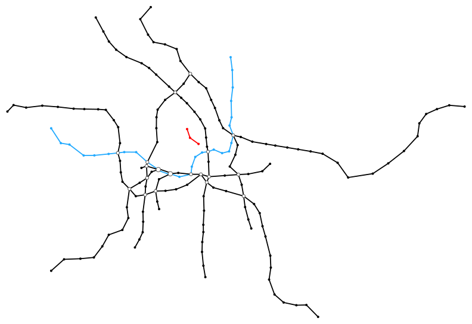
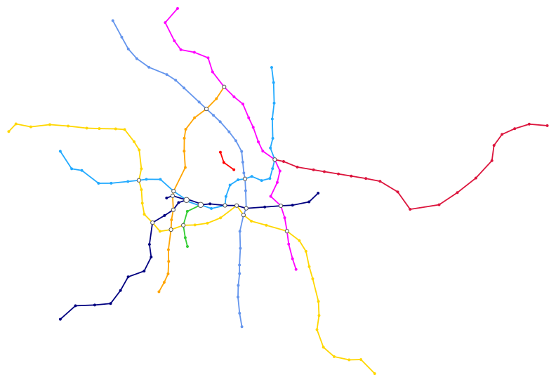

# colorize-transit-graph

Add “random” line colors to a given transit graph, e.g. generated using [`osm-transit-graph`](https://github.com/juliuste/osm-transit-graph).

[](https://www.npmjs.com/package/colorize-transit-graph)
[](https://travis-ci.org/juliuste/colorize-transit-graph)
[](https://greenkeeper.io/)
[](https://david-dm.org/juliuste/colorize-transit-graph)
[](license)
[](https://gitter.im/juliuste)

## Installation

```shell
npm install -g colorize-transit-graph
```

## Usage

The library will add `color` attributes to all lines / line groups that don't yet have color information. Existing colors will be conserved.

The output graph could then be drawn by using [`svg-transit-map`](https://github.com/juliuste/svg-transit-map).

### CLI

```shell
Usage:
    cat graph.json | colorize-transit-graph > colorized-graph.json
```

Where `graph.json` containts a graph object with three attributes:

```js
{
    nodes: [ // list of all nodes
        {
            id: "900000042101", // required
            metadata: {
                x: 537.029, // x-coordinate in any metric, required
                y: 673.576 // y-coordinate in any metric, required, see also the --invert-y option
            }
        }
        // …
    ],
    edges: [ // list of all edges
        {
            // the direction of the edge will be ignored, source and target are therefore interchangeable
            source: "900000120025", // node id, required
            target: "900000120008", // node id, required
            metadata: {
                lines :["U5","U6"] // list of line ids, required. please note that parallel lines must be modeled as one edge with two metadata.lines entries
            }
        }
        // …
    ],
    lines: [ // additional information for lines. if lines are not found in this list, default colour / group will be applied
        {
            id: 'U6', // line id, required
            color: '#456', // line colour, optional. existing information will be conserved
            group: 'U6' // line group id, optional. lines with the same group id will be merged info one for sections where they run in parallel
        }
        // …
    ]
}
```

### As a library

The module can be used as a JS library:

```js
const colorizeTransitGraph = require('colorize-transit-graph')
const graph = require('./graph.json') // your transit graph

const colorized = colorizeTransitGraph(graph)
```

## Example

Graphs drawn using [`svg-transit-map`](https://github.com/juliuste/svg-transit-map).

```shell
    cat example/berlin-input.json | colorize-transit-graph > example/berlin-output.json
    cat example/berlin-output.json | svg-transit-map > example/berlin-output.svg
```

## Input



## Output




## Contributing

If you found a bug or want to propose a feature, feel free to visit [the issues page](https://github.com/juliuste/colorize-transit-graph/issues).
